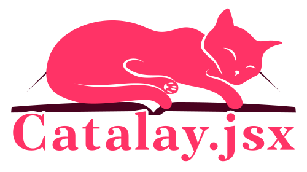

# Catalay 
[](https://github.com/indiscipline/catalay/blob/master/LICENSE.md)

Catalay is a free software suite designed to automate the layout of image catalogues made with Adobe InDesign, using simple, declarative, human readable and editable config files in TOML or YAML formats as input.

The main feature of Catalay is finding the optimal grid layouts for multiple distinctive groups of items, preserving their relative size ratios while filling as much space on the page as possible.

The main standalone program processes the user-provided input files, calculates the best layouts for each page, generates the HTML preview for quick visual inspection and outputs a JSON file, which is then used by the complimentary Catalay.jsx script to compile the catalogue in InDesign.

Catalay can significantly reduce the time and effort required to create complex image catalogues, freeing the users of routine labour and allowing them to focus on less tedious and more meaningful parts of their job. The resulting layouts are highly efficient, precise and ready for fine-tuning.

Although Catalay is tailored for a specific use-case, it probably means it's the only alternative to incessant unassisted drudgery of selecting, moving, resizing and aligning.

<aside>
# Table of Contents
- [Usage](#usage)
  * [Usage example](#usage-example)
  * [Input file description](#input-file-description)
  * [Output file description](#output-file-description)
  * [Installation](#installation)
  * [Catalay.jsx](#catalay.jsx)
- [FAQ](#faq)
- [TODO:](#todo-)
- [Contributing](#contributing)
- [License](#license)
- [Disclaimer](#disclaimer)
</aside>

# Usage

Run `catalay --help` to list all the available options.

## Usage example
To create a catalogue with Catalay, download it, install Catalay.jsx script and follow these steps:

1. Create a configuration file in either TOML or YAML format, following the configuration file description below.
2. Run `catalay MY_CONFIG.toml`, substituting the name of the config file.
3. Inspect the produced layout opening `preview.html` (saved along the output JSON) in your browser.
4. Open InDesign, open the *Scripts panel* and run the Catalay.jsx script.
5. Select the produced output file in the opened file dialog and follow along.
6. Catalay.jsx will compile the new catalogue, filling the rectangle placeholders with the appropriate images and text.

During its execution, Catalay will print the calculation statistics and save the results to `out.json` (or the provided file path). Unless the `-H` option was used, Catalay will also save the `preview.html` with all the pages. Individual page layouts can also be saved as SVG files using the `--svg` option.

## Input file description
<!-- TODO: Annotated in.toml -->

Config files for Catalay are meant to be the only thing the user needs to spend his time on to layout and compile the catalogue.

Catalay supports input in TOML and YAML formats with an identical schema described below. The config file describes the basic page preferences for the document and properties of the images that will be included in the catalogue.

## Output file description

Catalay generates an HTML preview of the catalogue layout for quick visual inspection and finetuning of the input, and the main JSON file for Catalay.jsx to process and compile in InDesign.

This multi-step process was chosen for:

- The ease of integrating into various workflows and simplifying the possible interaction with other tools
- Increased overall performance
- Separation of concerns that lowers the barrier to entry for further development

## Installation
Catalay is tested to work under Windows and GNU/Linux. It should work on macOS with no changes.

Download the Catalay binary or the source code and Catalay.jsx from the [release assets](https://github.com/indiscipline/catalay/releases/latest).

The program can be compiled with all the dependencies by using Nim's Nimble package manager with the following command:

```
nimble install http://github.com/indiscipline/catalay
```

## Catalay.jsx 
Catalay.jsx is the InDesign script which reads the output JSON file and compiles the catalogue. Install it following [Adobe documentation](https://helpx.adobe.com/indesign/using/scripting.html):

> A quick way to locate the Scripts Panel folder is to right-click (Windows) or Control-click (macOS) a script in the Scripts panel and choose Reveal In Explorer (Windows) or Reveal In Finder (macOS).

<!-- Additional information on Catalay.jsx available in its own [readme](Catalay.jsx/README.md). -->

# FAQ

- > Why doesn't this program has feature X?

We encourage users to file feature requests and bug reports as issues in this repository. Even though the author cannot guarantee your request will be implemented, any feedback (including negative) is useful and much appreciated.

- > I click on the program executable and nothing opens, is it broken?

No, Catalay is a command-line interface (CLI) program. You need to run it from a terminal or Command Prompt. **On Windows** you can open a command prompt by pressing Win+R, typing `cmd`, and pressing Enter. **On macOS**: press Cmd+Space to open spotlight search, type `terminal` and press return. **On GNU\Linux**… really?

- > How exactly does the program calculate the optimal layout?

Catalay uses a combination of a basic heuristic and a stochastic optimization algorithm to calculate the grid layout for multiple distinctive groups of items on a page in a close to optimal way in a constant time.

- > Why is it free (noncommercial)?

Catalay is a niche tool and not likely to generate significant interest, even though it's designed to help with and battle tested in a *work* situation, where it proved to save time. If you happen to find Catalay useful, consider making a donation[^donations]. Just sharing it with others or contacting the author is great too. Catalay is released as Free Software because it's the only right thing to do.


# TODO:
- [ ] Introduce group weights to quickly fine-tune relative scaling of the image groups on the page
- [ ] Support omitting group titles. For now it's possible to just leave the group title field empty (""), but the space will not be reused for image placement.
- [ ] Introduce additional layout constraints, such as minimal item margin.

# Contributing
The project is open for contributions. Open an [issue](https://github.com/indiscipline/Catalay/issues/) for bugs, ideas and feature requests.

# License
Catalay and Catalay.jsx are licensed under GNU General Public License version 3.0 or later; See `LICENSE.md` for full details.

[Catalay](catalay.svg) and [Catalay.jsx](catalay.jsx) logos are licensed under Creative Commons Attribution-NonCommercial-ShareAlike 4.0 International (CC BY-NC-SA 4.0)

# Disclaimer
Adobe InDesign product and logo are trademarks™ or registered® trademarks of their respective holders. Use of them does not imply any affiliation with or endorsement by them.

[^donations]: [Contact me](https://github.com/indiscipline) for now. I'm working on making it easier :)
