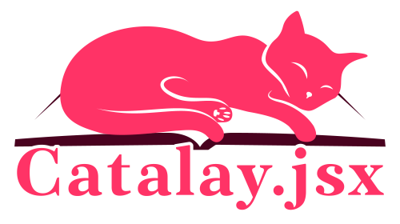

# Catalay.jsx 

Catalay.jsx is a complimentary InDesign script for compiling the catalogue from a layout JSON file, generated by the [main Catalay program](../README.md).

# Installation
Here's an excerpt from the [Adobe documentation](https://helpx.adobe.com/indesign/using/scripting.html):

> InDesign includes two panels for scripting: the Scripts panel and the Script Label panel.
>
> The Scripts panel is where you run scripts without leaving InDesign. The Scripts panel displays the scripts that are located in the Scripts folders in the InDesign application folder and in your Preferences folders.
>
> Select Windows > Utilities > Scripts to open the Scripts Panel. If you create or receive a script, you can place it in the Scripts Panel folder, so it shows up in the Scripts panel.
>
> - **macOS**: `Users/[username]/Library/Preferences/Adobe InDesign/[version]/[language]/Scripts/Scripts Panel`
> - **Windows XP**: `Documents and Settings\[username]\Application Data\Adobe\InDesign\[version]\[language]\Scripts\Scripts Panel`
> - **Windows Vista and Windows 7**: `Users\[username]\AppData\Roaming\Adobe\InDesign\[version]\[language]\Scripts\Scripts Panel`
>
> **Note**: A quick way to locate the Scripts Panel folder is to right-click (Windows) or Control-click (macOS) a script in the Scripts panel and choose Reveal In Explorer (Windows) or Reveal In Finder (macOS). 

# Usage
Follow the [Catalay documentation](../README.md).

# Implementation details
Catalay.jsx is a pre-UXP script. It is intentionally written in an older format that, unfortunately, doesn't feature many quality-of-life improvements of modern JavaScript. This, however, has an advantage of supporting a wider set of InDesign versions.

## Contribution
The author of the initial version of the code is not a JavaScript expert, so any critique, fixes and bug reports are greatly appreciated.

Please, prefix the titles of the [issues](https://github.com/indiscipline/catalay/issues/) specific to this script with `jsx:`.

### TODO
- [ ] Rewrite in Nim or TypeScript. Both options are viable and better to be explored sooner, rather than later.

# License
Catalay and Catalay.jsx are licensed under GNU General Public License version 3.0 or later; See [`LICENSE.md`](../LICENSE.md) for full details.

[Catalay](catalay.svg) and [Catalay.jsx](catalay.jsx.svg) logos are licensed under Creative Commons Attribution-NonCommercial-ShareAlike 4.0 International (CC BY-NC-SA 4.0)

# Disclaimer
Adobe InDesign product and logo are trademarks™ or registered® trademarks of their respective holders. Use of them does not imply any affiliation with or endorsement by them.